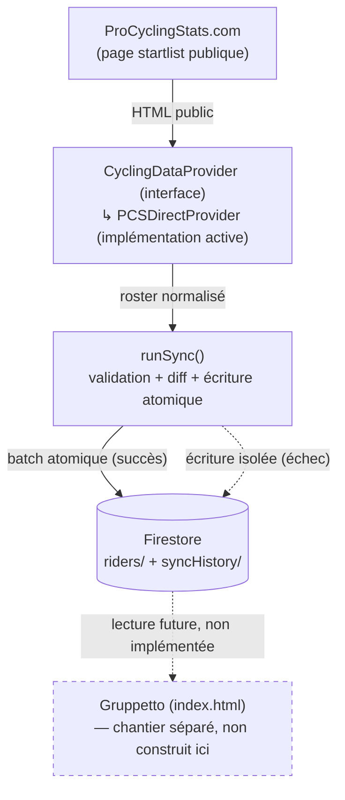

# Gruppetto Sync — Guide complet de validation et de déploiement

> Ce document est pensé pour être suffisant à lui seul, y compris si vous revenez dessus dans plusieurs semaines sans vous souvenir des détails. Vous ne devriez jamais avoir besoin de relire une conversation passée pour savoir quoi faire.

---

## 1. Présentation

### Le problème résolu

Jusqu'ici, savoir qu'un coureur avait abandonné (DNF), n'était pas au départ (DNS) ou avait été disqualifié (DSQ) demandait une vérification manuelle régulière, puis une mise à jour à la main dans Gruppetto.

### Ce que cette fonctionnalité automatise

Un service indépendant, exécuté chaque jour automatiquement (ou à la demande), qui :
1. récupère la liste réelle des coureurs et leur statut depuis ProCyclingStats.com ;
2. vérifie que cette donnée est cohérente (aucune anomalie de structure, d'effectif, de doublon) ;
3. ne met à jour Firestore **que si tout est validé**, en une seule opération atomique ;
4. conserve un historique complet de chaque synchronisation, réussie ou non.

### Ce qu'elle ne fait pas encore

- Elle **n'écrit pas** dans Gruppetto (`index.html`) elle-même. Elle dépose la donnée dans Firestore (`riders`, `syncHistory`) ; la lecture de cette donnée par l'application pour mettre à jour `CONFIG.teams[].riders[].abandonedAtStage` reste un chantier séparé, non construit ici.
- Elle ne récupère pas encore les résultats d'étape, les classements ni les maillots distinctifs (l'architecture le permettra plus tard — voir section 12).
- Elle ne gère qu'une seule course à la fois (celle configurée dans `config/raceConfig.js`).

### Architecture générale



```
  ProCyclingStats.com (page startlist publique)
              │
              ▼
  CyclingDataProvider (interface)
        └── PCSDirectProvider (implémentation active)
              │  roster normalisé { raceId, fetchedAt, riders[] }
              ▼
  runSync()
        ├── validateSnapshot()        (anomalies globales)
        ├── checkRosterConsistency()  (cohérence structurelle)
        ├── computeRiderDiff()        (changements, dans les deux sens)
        └── écriture atomique — SEULEMENT si tout est validé
              │
              ▼
  Firestore
        ├── riders/{raceId}__{riderId}
        └── syncHistory/{auto-id}
              │
              ▼
  Gruppetto (index.html)  ← chantier séparé, non construit ici
```

---

## 2. Arborescence complète

```
sync/
├── package.json
├── run.js
├── sync.js
├── diff.js
├── monitoring.js
├── rosterConsistency.js
├── syncHistoryEntry.js
├── firestoreRiderStore.js
├── config/
│   └── raceConfig.js
├── providers/
│   ├── CyclingDataProvider.js
│   ├── PCSDirectProvider.js
│   └── pcsNormalize.js
└── tests/
    ├── FakeRiderStore.js
    ├── verify-live.js
    ├── pcsNormalize.test.js
    ├── monitoring.test.js
    ├── rosterConsistency.test.js
    ├── sync.test.js
    ├── PCSDirectProvider.test.js
    └── fixtures/
        └── startlist-sample.html

.github/
└── workflows/
    └── sync-riders.yml
```

**Aucun fichier existant de Gruppetto (`index.html`) n'a été modifié.** Ce chantier est entièrement additif — de nouveaux fichiers, dans de nouveaux dossiers, à côté de l'application existante.

### Rôle, raison d'être, appelant et dépendances — fichier par fichier

| Fichier | Rôle | Pourquoi il existe | Qui l'utilise | Dépendances |
|---|---|---|---|---|
| `providers/CyclingDataProvider.js` | Contrat commun à tout fournisseur de données cyclistes (`fetchRoster()` + 3 méthodes réservées pour plus tard). | Pour pouvoir changer de fournisseur un jour sans toucher au reste du code. | `PCSDirectProvider.js` (l'étend) | aucune |
| `providers/pcsNormalize.js` | Fonctions pures : découpe "SURNOM Prénom", extrait un statut `(DNF #6)`. | Isoler la logique de normalisation, testable sans Cheerio. | `PCSDirectProvider.js` | aucune |
| `providers/PCSDirectProvider.js` | Télécharge la page startlist PCS, la parse avec Cheerio, retourne un roster normalisé. | C'est le fournisseur de données choisi après le PoC (gratuit, données confirmées disponibles). | `run.js`, `tests/verify-live.js` | `cheerio`, `pcsNormalize.js` |
| `config/raceConfig.js` | `EXPECTED_TEAMS` (23 équipes attendues) + `KNOWN_RIDERS` (coureurs de référence). | Configuration propre à la course suivie, réutilisée à la fois par la production et les tests — d'où sa place à la racine, pas dans `tests/`. | `run.js`, `tests/verify-live.js` | aucune |
| `monitoring.js` | `validateSnapshot()` — détecte un effectif anormal ou une variation brutale. | Premier filet de sécurité, générique, indépendant de la course suivie. | `sync.js` | aucune |
| `rosterConsistency.js` | `checkRosterConsistency()` — équipes, doublons, coureurs de référence, rapport ✓/✗. | Deuxième filet de sécurité, plus fin, spécifique à la structure attendue. | `sync.js` | aucune |
| `diff.js` | `computeRiderDiff()` — compare le nouveau roster à l'ancien, dans les deux sens. | Ne jamais supposer qu'un changement de statut ne peut aller que dans un sens. | `sync.js` | aucune |
| `syncHistoryEntry.js` | Construit les objets à écrire dans `syncHistory` (succès/échec). | Séparer la construction de la donnée de son écriture réelle. | `sync.js` | aucune |
| `firestoreRiderStore.js` | Seule classe qui parle réellement à Firestore ; regroupe toutes les écritures de succès en un seul batch atomique. | Isoler Firestore du reste — le jour où vous changez de base de données, un seul fichier à remplacer. | `run.js` | `firebase-admin` (objet `db` injecté) |
| `sync.js` | Orchestrateur (`runSync`). Assemble tout ce qui précède ; garantit l'atomicité par construction. | Le cœur du système — un seul endroit où la décision "j'écris ou je n'écris pas" est prise. | `run.js`, `tests/verify-live.js`, `tests/sync.test.js` | tous les fichiers ci-dessus |
| `run.js` | Point d'entrée réel : initialise Firebase, câble le vrai provider et le vrai store, appelle `runSync()`. | C'est ce que GitHub Actions exécute en production. | GitHub Actions (`sync-riders.yml`) | `firebase-admin`, `sync.js`, `PCSDirectProvider.js`, `raceConfig.js` |
| `tests/FakeRiderStore.js` | Faux store Firestore en mémoire. | Tester `sync.js` sans jamais toucher un vrai projet Firebase. | tests unitaires, `verify-live.js` | aucune |
| `tests/verify-live.js` | Appelle `runSync()` avec le vrai provider et un `FakeRiderStore` — vrai réseau, zéro écriture réelle. | Vérifier que le parsing PCS fonctionne toujours, sans risque. | vous, à la main | `sync.js`, `PCSDirectProvider.js`, `FakeRiderStore.js`, `raceConfig.js` |
| `.github/workflows/sync-riders.yml` | Planifie `run.js` chaque jour à 00h15 (Paris), + déclenchement manuel. | Automatiser sans serveur dédié. | GitHub Actions | — |

---

## 3. Dépendances

| Dépendance | Pourquoi | Version recommandée |
|---|---|---|
| `cheerio` | Parseur HTML façon jQuery — analyse la vraie structure de la page PCS plutôt que des expressions régulières fragiles. | `^1.0.0` |
| `firebase-admin` | SDK officiel pour écrire dans Firestore depuis un environnement serveur (GitHub Actions), avec des privilèges complets via un compte de service. | `^12.0.0` |
| `jest` (dev) | Exécute les tests unitaires (`npm test`). | `^29.0.0` |

Aucune autre dépendance. `package.json` est déjà configuré avec ces trois-là.

---

## 4. Ce qu'il restera à faire sur votre PC

Ordre exact à respecter :

```
□ 1. Récupérer les fichiers (dézipper l'archive livrée dans le dépôt Gruppetto)
□ 2. Installer les dépendances (npm install)
□ 3. Lancer les tests unitaires (npm test)
□ 4. Lancer verify-live.js (test réseau réel, sans risque)
□ 5. Créer/vérifier le projet Firebase et Firestore
□ 6. Créer le compte de service Firebase
□ 7. Créer le secret GitHub FIREBASE_SERVICE_ACCOUNT
□ 8. Déclencher le workflow GitHub Actions manuellement
□ 9. Vérifier syncHistory et riders dans la console Firebase
□ 10. Répéter l'étape 8 une ou deux fois à quelques heures d'écart
□ 11. Laisser le cron automatique prendre le relais
□ 12. (Plus tard, chantier séparé) Brancher Gruppetto sur ces données
```

Chaque étape est détaillée dans les sections suivantes.

---

## 5. Firebase

### 5.1 Si vous n'avez pas encore de projet Firebase dédié

Gruppetto utilise déjà un projet Firebase (`gruppetto-appli`, visible dans le code de l'application, section `FIREBASE_CONFIG`). **Réutilisez ce même projet** — pas besoin d'en créer un nouveau, sauf si vous souhaitez explicitement isoler ces données. Si un nouveau projet est néanmoins souhaité : console.firebase.google.com → *Ajouter un projet* → suivre l'assistant (aucune option particulière à cocher).

### 5.2 Firestore

Si Firestore n'est pas encore activé sur ce projet : console Firebase → *Firestore Database* → *Créer une base de données* → mode production → région de votre choix (ex. `eur3` si vous êtes en Europe). Aucune collection à créer manuellement : `riders` et `syncHistory` seront créées automatiquement au premier document écrit.

### 5.3 Structure des collections

**`riders/{raceId}__{riderId}`** — un document par coureur :
```json
{
  "raceId": "tour-de-france/2026",
  "firstName": "Bert",
  "lastName": "VAN LERBERGHE",
  "team": "Soudal Quick-Step",
  "status": "dnf",
  "sinceStage": 6,
  "sourceRiderId": "/rider/bert-van-lerberghe",
  "updatedAt": "2026-07-18T00:15:04.000Z"
}
```

**`syncHistory/{identifiant automatique}`** — un document par synchronisation :
```json
{
  "timestamp": "2026-07-18T00:15:00.000Z",
  "provider": "pcs-direct",
  "raceId": "tour-de-france/2026",
  "riderCount": 184,
  "changesCount": 2,
  "changes": [
    { "sourceRiderId": "/rider/...", "lastName": "...", "team": "...", "from": "active", "to": "dnf", "fromStage": null, "toStage": 6 }
  ],
  "success": true,
  "errorMessage": null,
  "durationMs": 842
}
```

### 5.4 Créer le compte de service

1. Console Firebase → icône d'engrenage → *Paramètres du projet* → onglet *Comptes de service*.
2. Bouton *Générer une nouvelle clé privée* → confirmer.
3. Un fichier `.json` se télécharge sur votre appareil. **Ne le déposez jamais dans le dépôt Git** — il donne un accès complet à votre projet Firebase.
4. Ouvrez ce fichier, copiez **tout son contenu** (accolade ouvrante à accolade fermante). C'est cette chaîne complète qui ira dans le secret GitHub (section 6).

---

## 6. GitHub Actions

### 6.1 Où placer le workflow

Le fichier `.github/workflows/sync-riders.yml` doit se trouver **exactement** à ce chemin, à la racine du dépôt (au même niveau que le dossier `sync/`, pas à l'intérieur).

### 6.2 Créer le secret `FIREBASE_SERVICE_ACCOUNT`

1. Sur GitHub.com, ouvrez le dépôt Gruppetto.
2. *Settings* (onglet du dépôt, pas du compte) → dans le menu de gauche, *Secrets and variables* → *Actions*.
3. Bouton *New repository secret*.
4. Nom : `FIREBASE_SERVICE_ACCOUNT` (exactement, respecter la casse).
5. Valeur : collez le contenu JSON complet copié à l'étape 5.4.
6. *Add secret*.

Ce secret n'est jamais visible en clair après création — c'est normal, c'est le principe d'un secret GitHub.

### 6.3 Tester le workflow manuellement

1. Onglet *Actions* du dépôt.
2. Dans la liste à gauche, cliquez sur *Synchronisation des coureurs*.
3. Bouton *Run workflow* (à droite) → laissez `raceId` à sa valeur par défaut → *Run workflow*.
4. Un nouveau run apparaît en haut de la liste avec une icône jaune (en cours), puis verte (succès) ou rouge (échec) après quelques dizaines de secondes.

### 6.4 Lire les logs

Cliquez sur le run → cliquez sur le job `sync` → dépliez l'étape *Lancer la synchronisation*. Vous devriez voir, ligne par ligne, exactement le même type de rapport que celui produit par `verify-live.js` (✓/✗ par contrôle), suivi de "Synchronisation terminée." si tout s'est bien passé.

### 6.5 Vérifier que la synchronisation s'est bien déroulée

Deux vérifications complémentaires :
- **Dans les logs GitHub Actions** : la dernière ligne doit être "Synchronisation terminée." (succès) et non "Synchronisation annulée." (échec).
- **Dans Firestore** : un nouveau document dans `syncHistory` avec `"success": true`.

### 6.6 Modifier le cron

Éditez `.github/workflows/sync-riders.yml`, ligne `cron: '15 22 * * *'`. Format : `minute heure jour mois jour-semaine`, toujours en UTC. Exemple : pour 06h00 heure de Paris (été, UTC+2), utilisez `'0 4 * * *'`.

### 6.7 Désactiver temporairement la synchronisation automatique

Deux options :
- **Rapide, réversible** : onglet *Actions* → *Synchronisation des coureurs* → menu *...* en haut à droite → *Disable workflow*. Réactivable en un clic (*Enable workflow*).
- **Définitive tant que non annulée** : commentez ou supprimez la section `schedule:` dans le fichier YAML (gardez `workflow_dispatch:` si vous voulez garder la main pour déclencher manuellement).

---

## 7. Première mise en production — procédure pas à pas

```
□ 1. cd sync && npm install
     → attendu : installation sans erreur.

□ 2. npm test
     → attendu : tous les tests passent (actuellement 34, hors ceux nécessitant
       un vrai réseau). Une ligne finale du type "Tests: X passed" sans échec.

□ 3. node tests/verify-live.js
     → attendu : une série de lignes "✓ ...", puis "✓ Validation réussie",
       code de sortie 0. Si une ligne "✗" apparaît, NE PAS continuer —
       direction section 9 (Dépannage).

□ 4. Créer/vérifier le compte de service Firebase (section 5.4)
     → attendu : un fichier .json téléchargé.

□ 5. Créer le secret GitHub FIREBASE_SERVICE_ACCOUNT (section 6.2)
     → attendu : le secret apparaît dans la liste (valeur masquée, c'est normal).

□ 6. Déclencher le workflow manuellement (section 6.3)
     → attendu : run vert, log se terminant par "Synchronisation terminée."

□ 7. Vérifier syncHistory et riders dans la console Firebase (section 6.5)
     → attendu : un document syncHistory avec success:true, et ~184 documents
       dans riders avec des statuts cohérents avec la vraie course.

□ 8. Répéter l'étape 6 une ou deux fois, à quelques heures d'intervalle
     → attendu : à chaque fois, un nouveau document syncHistory ; changesCount
       à 0 si rien n'a changé entre-temps, ce qui est un succès également.

□ 9. Laisser le cron faire son travail (déjà actif dès que le fichier YAML
     est présent sur la branche principale — rien à activer en plus)
     → attendu, le lendemain : un nouveau document syncHistory daté d'environ
       00h15 heure de Paris.
```

À quel moment "activer" le cron : **il l'est déjà** dès que `sync-riders.yml` est présent sur la branche par défaut du dépôt. Les étapes manuelles (6, 8) servent à vérifier AVANT de laisser le cron tourner sans supervision — il n'y a pas de bouton "activer le cron" séparé à chercher.

---

## 8. Vérifications — ce qui est normal, ce qui ne l'est pas

| Étape | Attendu | Anormal | Comment diagnostiquer |
|---|---|---|---|
| `npm install` | Se termine sans ligne `error` | Erreurs `E403`/`ENOTFOUND` | Vérifier la connexion réseau ; réessayer |
| `npm test` | Toutes les suites passent | Une suite échoue | Lire le message d'assertion précis affiché ; comparer au comportement attendu documenté dans le fichier de test concerné |
| `verify-live.js` | Que des `✓`, se termine par "Validation réussie" | Une ou plusieurs lignes `✗` | Lire le message exact — il nomme précisément ce qui cloche (équipe, doublon, coureur de référence...) |
| Workflow GitHub Actions | Icône verte, log se terminant par "Synchronisation terminée." | Icône rouge, "Synchronisation annulée." | Déplier les logs de l'étape *Lancer la synchronisation* ; le message d'erreur y est explicite |
| `syncHistory` | Nouveau document à chaque run, `success` cohérent avec l'icône du workflow | Aucun nouveau document | Le secret Firebase est probablement mal configuré — voir section 9 |
| `riders` | Un document par coureur, `status` cohérent avec la vraie startlist PCS | Collection vide malgré des runs "verts" | Vérifier le `raceId` utilisé (doit être identique entre les runs) |

---

## 9. Dépannage — FAQ complète

**Erreur Firebase (authentification)**
- *Symptômes* : le workflow échoue immédiatement, log mentionnant un problème de credential/certificate.
- *Cause probable* : le secret `FIREBASE_SERVICE_ACCOUNT` est absent, incomplet, ou mal collé (JSON tronqué).
- *Diagnostic* : régénérer une nouvelle clé de compte de service (section 5.4), la recoller intégralement.
- *Solution* : recréer le secret GitHub avec le JSON complet.

**Erreur GitHub Actions (le workflow ne se déclenche pas)**
- *Symptômes* : rien n'apparaît dans l'onglet Actions après le cron prévu.
- *Cause probable* : le workflow est désactivé (section 6.7), ou le fichier YAML n'est pas sur la branche par défaut.
- *Diagnostic* : onglet Actions → vérifier l'état du workflow (activé/désactivé) et la branche affichée.
- *Solution* : réactiver le workflow, ou fusionner le fichier sur la bonne branche.

**Erreur Cheerio / erreur de parsing**
- *Symptômes* : `verify-live.js` ou le workflow signalent 0 coureur récupéré, ou des coureurs "sans nom".
- *Cause probable* : ProCyclingStats a changé la structure HTML de sa page.
- *Diagnostic* : ouvrir la page startlist réelle dans un navigateur, comparer visuellement à la structure attendue.
- *Solution* : ajuster les sélecteurs dans `providers/PCSDirectProvider.js`, mettre à jour `tests/fixtures/startlist-sample.html`, relancer `npm test`.

**Changement de structure PCS détecté par les contrôles**
- *Symptômes* : `checkRosterConsistency` signale des équipes manquantes/incomplètes alors que rien n'a réellement changé côté course.
- *Cause probable* : `config/raceConfig.js` obsolète, ou structure PCS modifiée.
- *Diagnostic* : comparer manuellement `EXPECTED_TEAMS` à la vraie liste d'équipes sur PCS.
- *Solution* : mettre à jour `config/raceConfig.js` (section 10.2).

**Erreur réseau**
- *Symptômes* : message `PCSDirectProvider: réponse HTTP xxx` ou timeout.
- *Cause probable* : ProCyclingStats temporairement indisponible, ou blocage anti-bot (403/429).
- *Diagnostic* : ouvrir la page dans un navigateur pour confirmer qu'elle est accessible.
- *Solution* : relancer plus tard (déclenchement manuel) ; si récurrent, voir la limite connue correspondante (section 13).

**Firestore vide après un run "réussi"**
- *Symptômes* : `syncHistory` montre `success:true` mais `riders` reste vide.
- *Cause probable* : `raceId` incohérent entre l'écriture et votre vérification manuelle dans la console (vous cherchez peut-être sous un autre identifiant).
- *Diagnostic* : relire le champ `raceId` du document `syncHistory` le plus récent, chercher exactement cette valeur dans `riders`.
- *Solution* : aucune, c'est probablement une erreur de recherche, pas un bug.

**"Aucun changement détecté" à chaque run**
- *Symptômes* : `changesCount: 0` systématiquement.
- *Cause probable* : c'est normal si aucun coureur n'a changé de statut depuis la dernière synchronisation — ce n'est pas une anomalie.
- *Diagnostic* : comparer manuellement à l'actualité de la course.
- *Solution* : aucune action nécessaire.

**Timeout**
- *Symptômes* : le job GitHub Actions reste "en cours" anormalement longtemps.
- *Cause probable* : absence de timeout réseau explicite dans le code actuel (limite connue, section 13).
- *Diagnostic* : attendre, ou annuler manuellement le run (bouton *Cancel workflow*).
- *Solution provisoire* : annuler et relancer manuellement. Solution définitive : ajouter un `AbortController` (non fait à ce jour, voir section 13).

---

## 10. Maintenance

**Suivre une nouvelle course** : voir section 10.2 et 10.3, puis mettre à jour la variable `raceId` utilisée par le `workflow_dispatch` (ou la valeur par défaut dans le YAML).

**10.2 — Modifier `EXPECTED_TEAMS`** : ouvrir `sync/config/raceConfig.js`, remplacer la liste par les noms exacts des équipes de la nouvelle course (tels qu'affichés par PCS, sans le suffixe `(WT)`/`(PRT)`).

**10.3 — Modifier `KNOWN_RIDERS`** : dans le même fichier, remplacer par 2-3 coureurs de référence de la nouvelle course (utile seulement si des DNF/DNS sont déjà connus au moment du déploiement ; sinon laisser `[]`).

**Changer de fournisseur de données** : créer une nouvelle classe dans `providers/`, respectant l'interface `CyclingDataProvider` (voir `PCSDirectProvider.js` comme modèle), puis la substituer dans `run.js` et `tests/verify-live.js`. Aucun autre fichier n'a besoin de changer — c'est exactement l'intérêt de l'abstraction posée dès le début.

**Modifier le cron** : section 6.6.

**Lancer une synchronisation manuelle** : section 6.3 (via GitHub Actions), ou `node run.js` en local si vous avez `FIREBASE_SERVICE_ACCOUNT` dans votre environnement.

**Désactiver temporairement** : section 6.7.

---

## 11. Architecture détaillée

`run.js` est le seul fichier qui connaît à la fois Firebase ET ProCyclingStats — il les câble tous les deux derrière l'orchestrateur générique `runSync()` (`sync.js`), qui lui ne connaît ni Firestore ni Cheerio directement, seulement les interfaces `provider` et `store` qu'on lui injecte.

**Circulation des données** : `provider.fetchRoster()` retourne un objet normalisé `{raceId, fetchedAt, riders[]}` → `sync.js` le fait passer par `validateSnapshot()` (anomalies globales) puis `checkRosterConsistency()` (cohérence structurelle) → si les deux réussissent, `computeRiderDiff()` compare au dernier état connu (lu via `store.readCurrentStatuses()`) → le résultat (roster + diff + entrée d'historique) part dans un unique appel à `store.commitSuccess()`, atomique. En cas d'échec à n'importe quelle étape, seul `store.commitFailure()` est appelé, qui n'écrit jamais que dans `syncHistory`.

**Pourquoi cette séparation** : chaque brique (`monitoring.js`, `rosterConsistency.js`, `diff.js`, `syncHistoryEntry.js`) est une fonction pure, sans effet de bord, testable isolément. `firestoreRiderStore.js` est la seule à parler réellement à une base de données. Cette frontière nette est ce qui a permis de tester l'intégralité de la logique d'atomicité sans jamais toucher un vrai projet Firebase.

---

## 12. Évolutions futures

`CyclingDataProvider` réserve déjà les signatures suivantes, non implémentées :

```js
async fetchStageResult(raceId, stageNumber) { ... }
async fetchGeneralClassification(raceId, uptoStage) { ... }
async fetchJerseyHolders(raceId, uptoStage) { ... }
```

Le jour où l'une de ces fonctionnalités sera construite, elle suivra le même schéma déjà éprouvé : implémentation dans `PCSDirectProvider` (ou un nouveau provider), validation dédiée, écriture atomique dans une collection Firestore dédiée. Aucun changement structurel n'est nécessaire — seulement de nouvelles implémentations derrière une interface déjà en place.

**Suivre le Giro ou la Vuelta** : aucun changement de code, seulement `config/raceConfig.js` (section 10.2/10.3) et le `raceId` transmis à `run.js` — l'architecture entière (provider, validation, atomicité, historique) est déjà générique, non spécifique au Tour de France.

**Suivre plusieurs courses simultanément** : non prévu tel quel aujourd'hui (le workflow ne cible qu'un seul `raceId` par exécution), mais faisable en dupliquant l'étape du workflow avec un `raceId` différent, ou en bouclant sur plusieurs courses dans `run.js` — à concevoir le jour où le besoin est réel, pas avant.

---

## 13. Limites connues

Reprises de l'audit — dette technique assumée consciemment, pas des oublis.

| Limite | Pourquoi non corrigée maintenant | Quand la traiter |
|---|---|---|
| `config/raceConfig.js` figé sur une course | Corriger maintenant aurait demandé de concevoir un mode d'amorçage automatique — un vrai chantier, pas un ajustement mineur, alors qu'aucun second usage réel n'existe encore pour le justifier | Dès qu'une deuxième course est réellement suivie |
| Aucun timeout réseau explicite | Risque réel mais faible impact (un run bloqué se voit et s'annule manuellement) ; le PoC n'a jamais rencontré ce cas | Si un jour un run reste bloqué en pratique |
| Collision possible de `riderDocId` sans `sourceRiderId` | Cas limite rare (deux coureurs homonymes sans lien PCS détecté) jamais observé en conditions réelles | Si un jour un doublon de ce type est effectivement constaté |
| Correction rétroactive d'étape sans changement de statut non testée | Le comportement est déjà correct dans le code ; seul le test manque | Prochaine session de renforcement des tests |
| 403/429 et erreur structurelle indiscernables dans les logs | Optimisation de confort, pas un risque de donnée | Si des échecs répétés rendent le diagnostic pénible en pratique |

---

## 14. Conclusion

Ce service tourne indépendamment de Gruppetto, une fois par jour (ou à la demande), pour maintenir à jour le statut réel des coureurs d'une course suivie. Il ne modifie jamais Firestore tant que la donnée récupérée n'a pas passé deux couches de validation indépendantes, et regroupe toujours ses écritures de succès en une seule opération atomique — jamais d'état intermédiaire, jamais de perte de donnée en cas d'échec. L'historique complet de chaque tentative, réussie ou non, est conservé pour un diagnostic ultérieur. La connexion à Gruppetto lui-même reste à construire, volontairement, comme un chantier distinct.

---

## Guide de mise en production — étape par étape

Chaque étape suit le même format : pourquoi, où, quoi faire, ce que vous devez obtenir, les erreurs les plus courantes, et comment vérifier avant de passer à la suite. Suivez-les dans l'ordre, sans en sauter.

---

### Étape 1 — Déposer les fichiers dans le dépôt

**Pourquoi** : tout ce qui a été construit (le service de synchronisation, ses tests, le workflow) existe aujourd'hui dans une archive `.zip` que je vous ai fournie — pas encore dans votre dépôt réel.

**Où** : votre dépôt GitHub Gruppetto (via l'interface web GitHub, ou en local si vous avez un accès Git depuis votre PC).

**Quoi faire** : dézippez l'archive. Vous devez obtenir deux dossiers : `sync/` et `.github/workflows/`. Déposez-les à la **racine** du dépôt, exactement au même niveau que `index.html`. Si `.github/workflows/` existe déjà (peu probable), fusionnez son contenu plutôt que de l'écraser.

**Résultat attendu** : en listant la racine de votre dépôt, vous voyez `index.html`, `assets/`, `sync/` et `.github/` côte à côte.

**Erreurs courantes** :
- Le dossier `sync/` déposé *dans* un sous-dossier par erreur (ex. `assets/sync/`) — les chemins relatifs du code (`require('./providers/...')`) ne fonctionneraient plus.
- Le dossier `.github` renommé sans le point au début (invisible dans certains explorateurs de fichiers) — GitHub ne reconnaît un workflow que dans `.github/workflows/`, jamais ailleurs.

**Vérification avant de continuer** : ouvrez `sync/package.json` depuis l'interface GitHub — s'il s'affiche normalement, l'emplacement est correct.

---

### Étape 2 — Committer et pousser sur la branche principale

**Pourquoi** : GitHub Actions ne lit que ce qui est réellement présent sur la branche par défaut du dépôt (généralement `main`) — un fichier seulement "dézippé sur votre disque" n'a aucun effet tant qu'il n'est pas poussé.

**Où** : GitHub.com (upload direct de fichiers, possible depuis un téléphone) ou un terminal Git sur votre PC.

**Quoi faire** :
- Depuis GitHub.com : bouton *Add file* → *Upload files* → glissez les dossiers `sync/` et `.github/` → renseignez un message de commit (ex. "Ajout du service de synchronisation des coureurs") → *Commit directly to the main branch*.
- Depuis un terminal : `git add sync .github && git commit -m "Ajout du service de synchronisation des coureurs" && git push`.

**Résultat attendu** : le commit apparaît dans l'historique du dépôt ; les nouveaux fichiers sont visibles en naviguant sur GitHub.com.

**Erreurs courantes** : pousser sur une branche secondaire par erreur (le workflow ne se déclenchera jamais dessus) ; oublier certains fichiers si l'upload web a été fait dossier par dossier au lieu de tout sélectionner d'un coup.

**Vérification avant de continuer** : sur GitHub.com, onglet *Code*, vérifiez que `sync/` et `.github/workflows/sync-riders.yml` sont bien visibles sur la branche affichée par défaut.

---

### Étape 3 — Installer les dépendances (`npm install`)

**Pourquoi** : le code utilise deux bibliothèques externes (`cheerio`, `firebase-admin`) qui ne sont pas incluses dans les fichiers livrés — elles doivent être téléchargées une fois.

**Où** : un terminal, sur un ordinateur (pas faisable depuis un téléphone seul, sauf environnement type Termux/Cloud Shell).

**Quoi faire** : `cd sync` puis `npm install`.

**Résultat attendu** : un dossier `sync/node_modules/` apparaît, et le terminal affiche un résumé du type "added XX packages" sans ligne commençant par `error`.

**Erreurs courantes** : `E403`/`ENOTFOUND` (pas de connexion réseau, ou proxy d'entreprise bloquant npm) ; version de Node.js trop ancienne (`npm install` fonctionne à partir de Node 18+, recommandé : Node 20).

**Vérification avant de continuer** : `node -e "require('cheerio'); require('firebase-admin'); console.log('OK')"` doit afficher `OK` sans erreur.

---

### Étape 4 — Lancer les tests unitaires (`npm test`)

**Pourquoi** : confirmer que tout le code se comporte comme prévu, sans dépendre du réseau ni de Firebase — un filet de sécurité avant d'aller plus loin.

**Où** : le même terminal, toujours dans `sync/`.

**Quoi faire** : `npm test`.

**Résultat attendu** : une sortie Jest listant chaque test avec un ✓ vert, se terminant par un résumé du type `Tests: 34 passed, 34 total` (le nombre exact peut varier légèrement selon la version de Jest installée).

**Erreurs courantes** : un test échoue après une modification manuelle du code — le message d'assertion Jest indique précisément quelle valeur était attendue et laquelle a été obtenue.

**Vérification avant de continuer** : la ligne finale ne doit contenir aucun `failed`.

---

### Étape 5 — Test d'intégration réel (`verify-live.js`)

**Pourquoi** : c'est le seul test qui fait un vrai appel réseau vers ProCyclingStats — il confirme que le site n'a pas changé de structure depuis la construction du code, **sans risque** puisqu'il n'écrit jamais dans Firestore.

**Où** : le même terminal.

**Quoi faire** : `node tests/verify-live.js`.

**Résultat attendu** : une série de lignes `✓ ...` (nombre de coureurs, équipes détectées, coureurs de référence retrouvés...), se terminant par `✓ Validation réussie`.

**Erreurs courantes** : une ou plusieurs lignes `✗` — le message nomme précisément le problème (ex. "Équipe X introuvable", "Coureur de référence Y introuvable"). Si cela arrive, **ne passez pas à l'étape suivante** : direction la section Dépannage.

**Vérification avant de continuer** : le code de sortie du script doit être 0 — sur la plupart des terminaux, la commande `echo $?` juste après affiche ce code.

---

### Étape 6 — Générer la clé de compte de service Firebase

**Pourquoi** : GitHub Actions doit pouvoir écrire dans votre Firestore en votre nom, sans que vous ne saisissiez de mot de passe à chaque fois — un compte de service est une identité technique dédiée à cet usage.

**Où** : console.firebase.google.com, projet `gruppetto-appli` (ou le projet Firebase utilisé par Gruppetto).

**Quoi faire** : icône d'engrenage (en haut à gauche) → *Paramètres du projet* → onglet *Comptes de service* → bouton *Générer une nouvelle clé privée* → confirmer dans la fenêtre d'avertissement.

**Résultat attendu** : un fichier `.json` se télécharge sur votre appareil, avec un nom du type `gruppetto-appli-firebase-adminsdk-xxxxx.json`.

**Erreurs courantes** : ne pas avoir les droits *Propriétaire*/*Éditeur* sur le projet Firebase (le bouton peut être grisé) — dans ce cas, il faut que la personne propriétaire du projet réalise cette étape.

**Vérification avant de continuer** : ouvrez le fichier téléchargé dans un éditeur de texte — il doit commencer par `{` et contenir un champ `"private_key"`. **Ne le partagez avec personne, ne le committez jamais dans le dépôt.**

---

### Étape 7 — Créer le secret GitHub `FIREBASE_SERVICE_ACCOUNT`

**Pourquoi** : c'est le moyen sécurisé de mettre ce fichier JSON à la disposition du workflow GitHub Actions, sans jamais l'exposer publiquement dans le code.

**Où** : GitHub.com, dépôt Gruppetto.

**Quoi faire** : onglet *Settings* du dépôt → menu de gauche, *Secrets and variables* → *Actions* → bouton *New repository secret* → Nom : `FIREBASE_SERVICE_ACCOUNT` (exactement) → Valeur : ouvrez le fichier de l'étape 6, sélectionnez tout son contenu, collez-le intégralement → *Add secret*.

**Résultat attendu** : `FIREBASE_SERVICE_ACCOUNT` apparaît dans la liste des secrets du dépôt (sa valeur reste toujours masquée, c'est normal et volontaire).

**Erreurs courantes** : coller seulement une partie du JSON (tronqué lors d'un copier-coller sur mobile, par exemple) ; faute de frappe dans le nom du secret (le nom doit correspondre **exactement** à celui lu dans `run.js` et dans le workflow).

**Vérification avant de continuer** : aucune vérification directe possible (la valeur est masquée par principe) — la vraie vérification se fera à l'étape 8.

---

### Étape 8 — Déclencher le workflow manuellement

**Pourquoi** : tester tout l'enchaînement (Node.js + Firebase + réseau) une première fois, dans des conditions contrôlées, avant de laisser le cron s'en charger seul chaque nuit.

**Où** : GitHub.com, dépôt Gruppetto, onglet *Actions*.

**Quoi faire** : dans la liste à gauche, cliquez sur *Synchronisation des coureurs* → bouton *Run workflow* → laissez `raceId` à sa valeur par défaut → *Run workflow*.

**Résultat attendu** : un nouveau run apparaît, passe d'une icône jaune (en cours) à verte (succès) en général en moins d'une minute.

**Erreurs courantes** : icône rouge — cliquez sur le run, puis sur le job, pour lire le message d'erreur précis (souvent lié au secret Firebase, voir Dépannage).

**Vérification avant de continuer** : le run doit être vert avant de passer à l'étape 9.

---

### Étape 9 — Vérifier Firestore

**Pourquoi** : confirmer que les données sont réellement arrivées à destination, pas seulement que le workflow s'est "bien passé" du point de vue de GitHub.

**Où** : console.firebase.google.com → *Firestore Database*.

**Quoi faire** : ouvrez la collection `syncHistory`, triez par date décroissante si possible, ouvrez le document le plus récent. Ouvrez ensuite la collection `riders`.

**Résultat attendu** : dans `syncHistory`, un document avec `"success": true` et un horodatage récent. Dans `riders`, un document par coureur (environ 184 pour le Tour de France), chacun avec un champ `status` cohérent avec la réalité de la course.

**Erreurs courantes** : les deux collections restent vides malgré un run vert — vérifiez que le compte de service utilisé a bien les droits d'écriture sur Firestore (rôle *Cloud Datastore User* ou *Editor* a minima).

**Vérification avant de continuer** : les deux collections contiennent bien des documents cohérents.

---

### Étape 10 — Répéter à quelques heures d'intervalle

**Pourquoi** : une seule exécution réussie peut être un coup de chance ; observer 2-3 exécutions à des moments différents de la journée donne une vraie confiance avant de laisser tourner sans supervision.

**Où** : GitHub Actions, comme à l'étape 8.

**Quoi faire** : relancez *Run workflow* une à deux fois de plus, à quelques heures d'écart.

**Résultat attendu** : à chaque fois, un nouveau document `syncHistory`. Si rien n'a changé dans la course entre-temps, `changesCount: 0` est un **succès**, pas une anomalie.

**Erreurs courantes** : aucune spécifique à cette étape — les mêmes que celles des étapes 8-9 peuvent réapparaître.

**Vérification avant de continuer** : au moins deux exécutions réussies consécutives.

---

### Étape 11 — Laisser le cron automatique prendre le relais

**Pourquoi** : c'est l'objectif final — plus aucune intervention manuelle quotidienne.

**Où** : nulle part en particulier — c'est une étape d'attente, pas d'action.

**Quoi faire** : rien. Le cron (00h15 heure de Paris) est **déjà actif** dès que `sync-riders.yml` est présent sur la branche principale depuis l'étape 2 — il n'existe pas de bouton "activer" séparé.

**Résultat attendu** : le lendemain matin, un nouveau document `syncHistory` daté d'environ 00h15-00h16 heure de Paris, apparu sans que vous n'ayez rien déclenché.

**Erreurs courantes** : aucun nouveau document le lendemain — voir section Dépannage, "GitHub Actions ne se déclenche pas".

**Vérification avant de continuer** : ce nouveau document existe bien, avant de considérer le cycle quotidien comme fiable.

---

### Étape 12 — (Plus tard, hors périmètre actuel) Brancher Gruppetto sur ces données

**Pourquoi** : aujourd'hui, Firestore est alimenté, mais rien dans `index.html` ne va encore lire `riders`/`syncHistory` pour mettre à jour `CONFIG.teams[].riders[].abandonedAtStage` automatiquement.

**Où** : à définir le moment venu.

**Quoi faire** : rien maintenant — c'est volontairement un chantier séparé, à ouvrir uniquement quand vous le déciderez.

**Résultat attendu** : sans objet pour l'instant.

---

# Validation finale

```
□ Tous les fichiers sont bien présents dans le dépôt (sync/ + .github/workflows/)
□ npm install réussi
□ npm test réussi (toutes les suites, sans échec)
□ verify-live.js réussi (✓ Validation réussie, code de sortie 0)
□ Compte de service Firebase généré
□ Secret GitHub FIREBASE_SERVICE_ACCOUNT créé
□ Workflow GitHub Actions exécuté avec succès (au moins 2 fois)
□ Firestore correctement alimenté (riders + syncHistory contiennent des documents cohérents)
□ syncHistory créé à chaque exécution, y compris "aucun changement"
□ Cron actif (un document syncHistory apparu sans déclenchement manuel)
□ Synchronisation automatique validée sur au moins 24h
□ Gruppetto lit correctement les nouvelles données
  ⚠️ Pas encore applicable : ce chantier (étape 12) n'est volontairement pas
     construit à ce stade. Cette case ne pourra être cochée qu'après un
     développement séparé, non commencé. Ne pas s'inquiéter si elle reste
     vide — ce n'est pas un dysfonctionnement.
```

---

# Retour arrière

Si un problème survient, à n'importe quel moment, voici comment revenir en arrière, du plus rapide et réversible au plus radical.

### Désactiver le cron immédiatement (le plus rapide, entièrement réversible)

**Où** : GitHub.com → dépôt → onglet *Actions* → *Synchronisation des coureurs* → menu `...` en haut à droite → *Disable workflow*.

**Effet** : plus aucune exécution, automatique ou manuelle, tant qu'il n'est pas réactivé (*Enable workflow*, même endroit). Aucune donnée existante n'est touchée. C'est l'action à faire en premier en cas de doute, avant même de chercher la cause.

### Revenir à une version précédente du code

**Où** : terminal Git, ou interface GitHub (onglet *Commits* → bouton *Revert* sur le commit concerné).

**Effet** : restaure les fichiers `sync/` et `.github/workflows/` à leur état d'avant la modification problématique. N'affecte jamais Firestore (les données déjà écrites restent en place) — seul le code qui s'exécutera au prochain run change.

### Vider les données de test dans Firestore

**Où** : console Firebase → Firestore Database.

**Quoi faire** : si des documents de test ou incorrects ont été écrits (par exemple pendant la phase de validation initiale), sélectionnez-les individuellement dans `riders` ou `syncHistory` et supprimez-les via le bouton de suppression de document. **Il n'existe pas de bouton "vider toute la collection" dans l'interface standard** — pour une suppression en masse, il faudrait un script dédié, non fourni ici volontairement (risque trop élevé pour un geste aussi rare).

**Précaution** : rappel du principe déjà respecté par le code lui-même — ce service n'écrit jamais sur un rider existant de façon destructive (toujours `merge: true`), et ne supprime jamais un document. Une suppression manuelle reste donc le seul moyen de "revenir en arrière" sur une donnée déjà écrite.

### Revenir à un fonctionnement entièrement manuel

**Où** : GitHub Actions (désactiver le workflow, comme ci-dessus) + Gruppetto lui-même.

**Effet** : en désactivant simplement le workflow, plus aucune écriture automatique n'a lieu. Gruppetto continue de fonctionner exactement comme avant ce chantier — puisque, pour rappel, rien dans `index.html` ne dépend encore de ces données (section 12). Revenir en arrière ici n'a donc, à ce stade, aucun impact sur l'application elle-même : c'est une garantie de sécurité supplémentaire, pas seulement une conséquence du hasard.

